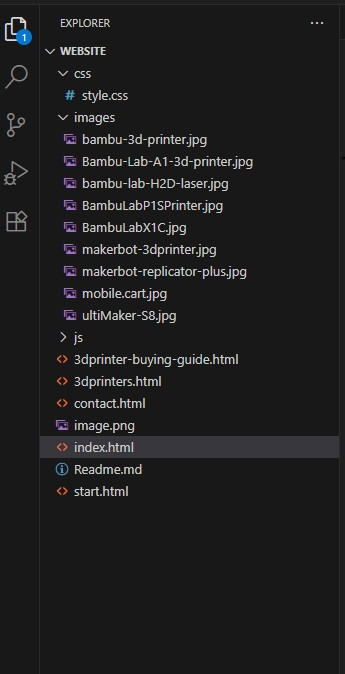

# 3D Mobile Makerspace: How-To Guide Website

Overview:

A capstone project for CodeYou: Kentucky. The project using a third party API while showcasing knowledge of HTML, CSS and JavaScript.

# Project Description

My capstone is a "How-to" website for creating a 3D Mobile Makerspace. The Website is designed to help educators and innovators plan, build, and manage a mobile 3D printing makerspace. It provides practical setup steps, equipment lists, instructional materials, and interactive features like a printer/tool search and design examples. The plan is to add a teacher reservation form. Implementing 3D printing into the curriculum is an daunting task to undertake. My website will help educators have basic understanding of what equipment to purchase when creating a 3D printing mobile makerspace.

## Project Organization

Currently, there are five pages of the website the user will be able to visit. The "home" page is the index page which holds links to the other web pages. More pages will be added.

Important pages are:

1. index.html (Home page: begin here.)
2. start.html (includes the checklist for teachers to use)
3. 3dprinter-buying-guide.html (this page contains the fetch API)
4. 3dprinters.html (this page includes my mobile makerspace inventory)
5. contact.html (allows educators to contact me for more information)

# Features Implements

1. A "Where do I start" checklist for teachers to get an idea of what to consider. 
2. 3D Printer Guide showcasing the best 3D printers for the classroom. 
3. Fetch API using Sketchfab Viewer API. The purpose of the API is to provide the user with examples of 3D printers and 3D Designs. The search results will return thumbnails of the images fetched. More information for the Sketchfab API can be found at this link: https://sketchfab.com/developers/viewer
4. Contact form for users to (eventually) email me. 

## Installation Instructions 

To set up the website locally:

Install Visual Studio Code to your computer. The link to download Visual Studio Code is: https://code.visualstudio.com/download. Choose the version of Visual Studio Code for the Operating System installed on your PC or MAC.

Add the Live Server extension in Visual Studio Code. This extension will allow the user to view the web pages locally. To install the Live Server extension, click on the "extension" icon, search for Live Server. Follow the installation instructions to install the extension.


Open the Terminal in VS Code: 
Clone this repository:
   ```bash
   git clone https://github.com/MzOutland/3d-makerspace-site.git
   ```

## How to Use the Website locally

In Visual Studio Code, in the left pane, open the WEBSITE folder which contains all HTML, CSS, and JS files needed to interact with the website locally.

## Homepage screenshot



1. Begin with index.html. Right click the file name, choose "Open with Liveserver".
2. The index.html will open in a browser.
3. Click on "3D Printers" button under Our Mobile MakerSpaces. This will show the inventory currently on hand for teachers to borrow (form will come later.) This page demonstrates an array that displays information.
4. Click on "Back to Home" to return to the main page.
5. Click on "Where do I start" to see a clickable "to do" list the user can interact with.
6. The 3dprinter-buying-guide page shows 3D printers recommended for purchase. Click the "Buy Now" button to go to the website to purchase.
7. To interact with the fetch API, click on "3D Printer Buying Guide". To use search Sketchfab, click in the Search models text box, type a name or keyword of something you want to print. For example, Pokemon, Tur, etc. Click "Search" button. Thumbnails should load into the page.

## Examples

## License

## Stretch Goals

Add a database for teachers to reserve my 3D Mobile Makerspace.
Create more pages to provide tutorials and videos for teachers

## Credits

1. Mentor Ken Quiggins assisted with API implementation.
2. Google search for images, examples and general questions.
3. ChatGPT was used for explanations on challenging concepts such as Fetch API, React, Express, etc.
4. Co-Pilot detected syntax errors inside of VS Code. The explanation assisted in my understanding of the errors and how to fix.
